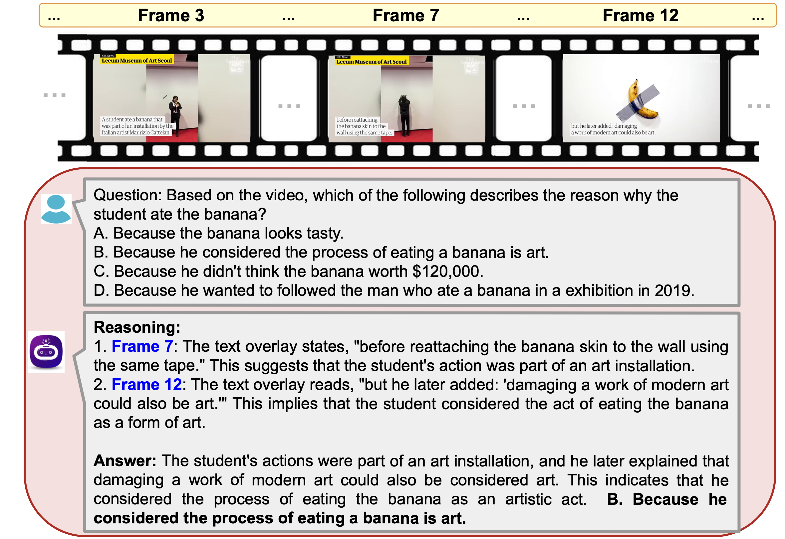

# Chain-of-Frames: Advancing Video Understanding in Multimodal LLMs via Frame-Aware Reasoning

### [Paper](https://arxiv.org/abs/2412.10594) | [CoF-Data](#data) | [Checkpoints](#checkpoints) | [Quick Start](#quick) | [Acknowledgement](#ack) 

<p float="left">
  
   
</p>

In this work, we propose to obtain video LLMs whose reasoning steps are grounded in, and explicitly refer to, the relevant video frames.
For this, we first create \cofdata, a large dataset of diverse questions, answers, and corresponding frame-grounded reasoning traces about both natural and synthetic videos, spanning various topics and tasks.
Then, we fine-tune existing video LLMs on this chain-of-frames (CoF) data.
Our approach is simple and self-contained, and, unlike existing approaches for video CoT, does not require auxiliary networks to select or caption relevant frames.
We show that our models based on CoF are able to generate chain-of-thoughts that accurately refer to the key frames to answer the given question.


<a name="data"></a>
### CoF-Data

<p float="center">

</p>

- [Annotation file](https://huggingface.co/saraghznfri/CoF-models/resolve/main/cof_data.jsonl)
<a name="checkpoints"></a>
### Checkpoints
- [CoF-InternVL2.5-4B](https://huggingface.co/saraghznfri/CoF-models/resolve/main/cof-4B.tar)
- [Cof-InternVL3-8B](https://huggingface.co/saraghznfri/CoF-models/resolve/main/cof-8B.tar)
  
<a name="quick"></a>
### Quick Start

```
import torch
from transformers import AutoTokenizer, AutoModel
model_path = "path/to/CoF-8B"
model = AutoModel.from_pretrained(
    model_path,
    torch_dtype=torch.bfloat16,
    low_cpu_mem_usage=True,
    use_flash_attn=True,
    trust_remote_code=True).eval().cuda()
tokenizer = AutoTokenizer.from_pretrained(model_path, trust_remote_code=True, use_fast=False)
generation_config = dict(max_new_tokens=2048, do_sample=False)
```
The model loading and evaluation procedures are similar to those used in InternVL; please refer to the InternVL documentation for additional details.
- Evaluation scripts for the video benchmarks:
  
```
bash scripts/eval/eval.sh 
```

<a name="ack"></a>
### Acknowledgement

This work leverages the code and resources from [InternVL](https://github.com/OpenGVLab/InternVL) repository. 

We thank the authors for making their work publicly available and contributing to the research community.

<a name="bibtex"></a>
### Citation
If you use our code or models, please consider citing our work using the following BibTex entry:
```
?
```
