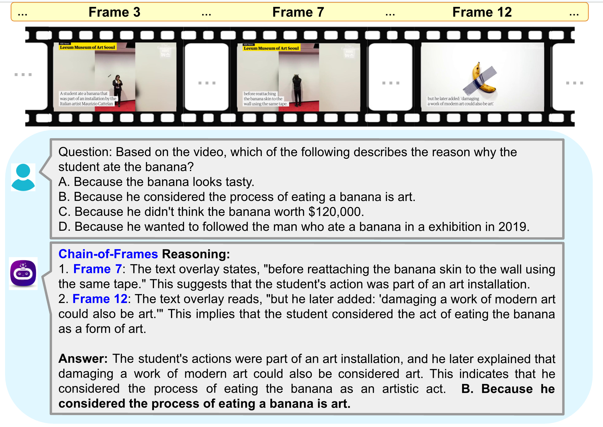
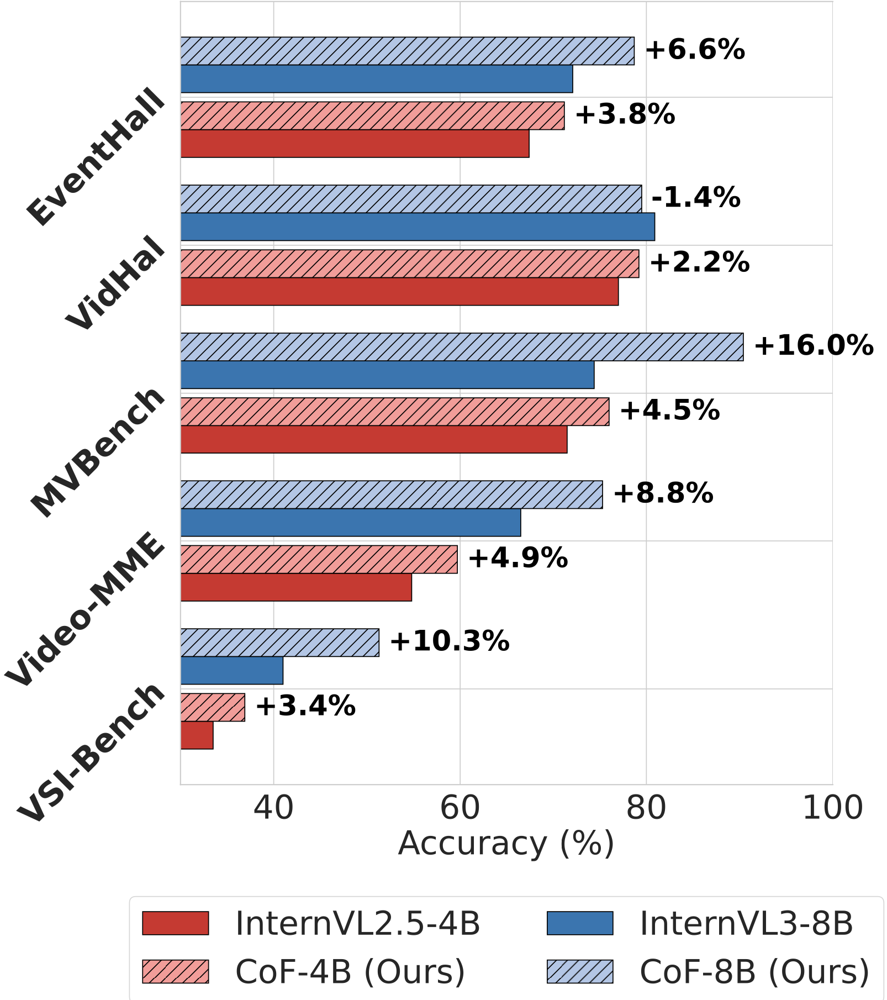
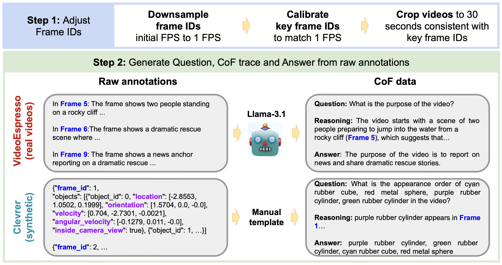

# Chain-of-Frames: Advancing Video Understanding in Multimodal LLMs via Frame-Aware Reasoning

### [Paper](https://arxiv.org/abs/2412.10594) | [CoF-Data](#data) | [CoF-Models](#checkpoints) | [Quick Start](#quick) | [Acknowledgements](#ack) 

&nbsp;

<p float="center">
  
   
</p>

We propose **chain-of-frames (CoF)** to obtain video LLMs whose reasoning steps are grounded in, and explicitly refer to, the relevant frames (see example in the left figure above).

We first create a large dataset of diverse questions, answers, and reasoning traces with references to frame IDs from both natural and synthetic videos.
Then, we fine-tune existing video LLMs on this chain-of-frames data (**CoF-Data**).
Our approach is simple and self-contained, and, unlike existing approaches for video CoT, does not require auxiliary networks or complex inference pipelines.

Our **CoF-InternVL2.5-4B** and **CoF-InternVL3-8B** models, based on CoF, outperform the baselines across several benchmarks (right figure above).
Moreover, they generate interpretable reasoning traces that accurately refer to the key frames to answer the given question.


<a name="data"></a>
### CoF-Data

The figure below summarizes the CoF-Data generation process, which yields our [video annotations](https://huggingface.co/saraghznfri/CoF-models/resolve/main/cof_data.jsonl).

<p float="center">

</p>

<a name="checkpoints"></a>
### Checkpoints
- [CoF-InternVL2.5-4B](https://huggingface.co/saraghznfri/CoF-models/resolve/main/cof-4B.tar)
- [Cof-InternVL3-8B](https://huggingface.co/saraghznfri/CoF-models/resolve/main/cof-8B.tar)
  
<a name="quick"></a>
### Quick Start

The model loading and evaluation procedures are similar to those used in the [InternVL](https://github.com/OpenGVLab/InternVL) repository; please refer to the InternVL documentation for additional details.

- To load our models:
```python
import torch
from transformers import AutoTokenizer, AutoModel
model_path = "path/to/CoF-8B"
model = AutoModel.from_pretrained(
    model_path,
    torch_dtype=torch.bfloat16,
    low_cpu_mem_usage=True,
    use_flash_attn=True,
    trust_remote_code=True).eval().cuda()
tokenizer = AutoTokenizer.from_pretrained(model_path, trust_remote_code=True, use_fast=False)
generation_config = dict(max_new_tokens=2048, do_sample=False)
```

- Evaluation scripts for the video benchmarks:
  
```
bash scripts/eval/eval.sh 
```

<a name="ack"></a>
### Acknowledgements

This work leverages the code and resources from [InternVL](https://github.com/OpenGVLab/InternVL) repository. 

We thank the authors for making their work publicly available and contributing to the research community.

<a name="bibtex"></a>
### Citation
If you use our code or models, please consider citing our work using the following BibTex entry:
```
?
```
